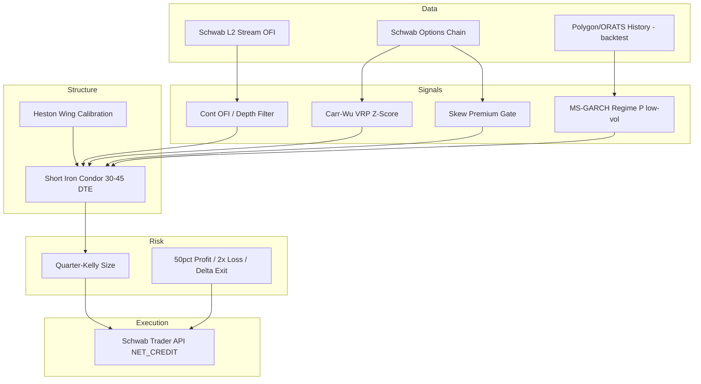

# MGO-VPH: Microstructure-Gated Optimized Variance Premium Harvester

## Executive recommendation

For a **$20,000** Schwab account with **Level 3 options** and **Level 2 market data**, the best *algorithmically orchestrable* quantitative income approach is:

> **Systematic, defined-risk short convexity (iron condors / credit spreads) on liquid ETFs, gated by model-free variance risk premium, Markov-switching volatility regime, and order-flow imbalance from Level 2 — with Heston-calibrated wings and fractional-Kelly sizing.**

This is superior to alternatives at your scale:

| Approach | Verdict at $20k on Schwab |
|----------|---------------------------|
| HFT market making (Avellaneda–Stoikov) | ❌ Needs rebates, colocation, $MM+ scale |
| Naked short puts / strangles | ❌ Tail risk inappropriate for income mandate |
| Wheel / covered call only | ⚠️ Capital-inefficient; single-factor |
| IV rank alone (retail theta) | ⚠️ No regime or microstructure protection |
| **MGO-VPH (this strategy)** | ✅ Defined risk, institutional filters, API-feasible |

---

## Strategy architecture



---

## Universe and instruments

**Primary (70% allocation):**

| Symbol | Rationale |
|--------|-----------|
| SPY | Deepest chain, tightest spreads, best L2 |
| QQQ | Tech vol premium, uncorrelated regime timing |
| IWM | Small-cap VRP often elevated |

**Secondary (30%, max 1 name):** XLF or GLD for diversification — only when VRP z-score > 1.5 on that name.

**Avoid:** single names under $50, earnings within DTE, ex-dividend week for American options on ETFs (minimal but monitor).

---

## Trade structure: short iron condor

**Why iron condor over naked short strangle at Level 3:**

- Defined max loss → compatible with fractional Kelly and 2% risk budget
- Schwab API supports `IRON_CONDOR` complex order type
- Margin predictable (~$300–600 per SPY condor at $5-wide wings)

**Construction rules:**

1. **DTE:** 30–45 days (enter Monday–Wednesday after 10:30 ET)
2. **Short strikes:** ~0.15–0.20 delta puts and calls (Heston-implied, not fixed delta)
3. **Wing width:** $3–$5 SPY; solve wing so Heston \(\mathbb{P}(\text{touches short strike}) < 12\%\)
4. **Credit target:** ≥ 25% of max loss (e.g., $1.25 on $5-wide = 25%)
5. **Quantity:** `floor(account_risk / max_loss_per_contract)` capped by Kelly module

**Alternate (high VRP, bullish OFI):** Put credit spread only (bullish bias) — uses less margin, allows 5th concurrent slot.

---

## Signal logic (composite score)

All conditions must pass for **ENTRY**:

```
ENTRY = (VRP_z > 1.0)
     AND (P_low_vol_regime > 0.65)
     AND (OFI_normalized in [-0.3, 0.5])   # not strongly bearish
     AND (SkewPremium > 0 OR structure is symmetric IC)
     AND (IV_30d > RV_forecast_5d)          # premium exists
     AND (no FOMC/CPI within 3 sessions)    # event calendar
     AND (open_positions < max_slots)
```

**EXIT triggers (any):**

| Trigger | Action |
|---------|--------|
| 50% of max profit | Close full structure (limit at mid) |
| Loss = 2× credit received | Stop loss |
| Short delta \|Δ\| > 0.35 on tested side | Reduce or close |
| VRP_z < 0 for 2 days | Close — edge gone |
| P_low_vol < 0.40 | Close all short vol — regime shift |
| OFI/depth < -1.5 for 15 min | Close put side or full IC |
| 21 DTE remaining | Close if not at 50% profit |

---

## Novel alpha-protection mechanism

**What most quants do:** IV rank + 30 delta + 45 DTE.

**What MGO-VPH adds:**

1. **Model-free VRP z-score** (Carr–Wu) — enter only when market pays above realized forecast  
2. **MS-GARCH regime probability** — hard stop on premium selling in high-vol state  
3. **OFI/depth gate from Schwab L2** — avoid opening short puts into aggressive sell flow  

The OFI gate is the differentiator: Cont, Kukanov & Stoikov (2014) show OFI explains ~65% of short-interval price variance. Using it as an **entry veto** for short gamma is rare in retail automation and difficult to arbitrage away without L2 infrastructure.

---

## Capital and risk budget ($20,000)

| Parameter | Value |
|-----------|-------|
| Cash reserve | 25% ($5,000) — assignment buffer |
| Deployable for margin | $15,000 |
| Max loss per trade | 2% account = $400 |
| Max concurrent structures | 4 |
| Max sector correlation | 2 SPY/QQQ combined |
| Portfolio vega cap | -$150 per 1% IV move (approx) |
| Monthly income target | $200–$500 (1–2.5% on deployed) |

**Example SPY iron condor:**

- $5-wide wings, $1.30 credit → max loss $3.70 = $370/contract  
- 1 contract fits risk budget  
- 4 contracts across SPY/QQQ/IWM/GLD → ~$1,480 max loss if all fail (theoretical; correlation makes this optimistic bound)

---

## Schwab API orchestration

### Authentication

- Two OAuth apps recommended: **Trader** (orders) + **Market Data** (quotes/stream)  
- Tokens refresh on schedule; store encrypted in env  

### Order payload pattern (iron condor)

```json
{
  "orderType": "NET_CREDIT",
  "session": "NORMAL",
  "duration": "DAY",
  "orderStrategyType": "SINGLE",
  "complexOrderStrategyType": "IRON_CONDOR",
  "price": "1.30",
  "orderLegCollection": [ /* 4 legs: STO/BTO puts, STO/BTO calls */ ]
}
```

Use `schwab-py` `OrderBuilder` or equivalent; always **preview order** before live submit.

### Market data

| Feed | Use |
|------|-----|
| Schwab L1 | Greeks, mid for management |
| Schwab L2 stream | OFI computation (10s buckets) |
| Schwab options chain | Strikes, IV, bid/ask |
| External (backtest) | Polygon options history |

### Limitations

- **No paper trading** — validate in replay/backtest first; go live with 1-contract tests  
- **No historical options in Schwab API** — budget $79/mo Polygon for backtest phase  
- **Rate limits** — batch chain requests; cache 60s  

---

## $600 supplemental tool budget

| Item | Cost | Purpose |
|------|------|---------|
| Polygon.io Options ($79/mo × 2) | $158 | Backtest VRP/IC history |
| Hetzner VPS CX22 | $6/mo × 12 | 24/7 bot + stream |
| Grafana Cloud free tier | $0 | Monitoring |
| Reserve | ~$370 | Scale data if profitable |

**Extension rule:** reinvest 20% of net monthly profits into tools (ORATS, IB backup data) after 3 profitable months.

---

## Daily orchestration schedule (ET)

| Time | Action |
|------|--------|
| 09:25 | Regime + VRP pre-compute from prior close |
| 09:45–10:15 | Accumulate OFI baseline |
| 10:30–14:00 | Entry window if signals pass |
| 15:45 | Mark-to-market, adjust stops |
| 16:15 | Log trades, update rolling VRP stats |

---

## Implementation phases

| Phase | Deliverable | Duration |
|-------|-------------|----------|
| 1 | Math core + backtest on Polygon | Research complete → code in `src/mgo_vph/` |
| 2 | Schwab OAuth + paperless replay | Validate fills/slippage model |
| 3 | Live 1-lot SPY IC | 4 weeks minimum |
| 4 | Full universe + automation | Scale to 4 slots |

---

## Kill switches (non-negotiable)

1. Account drawdown from peak ≥ 12% → halt all new entries 30 days  
2. Three consecutive max-loss stops → halve position size  
3. VIX front > 35 → close all short vol within 1 hour  
4. API/auth failure → no new orders; manage existing via mobile only  

---

## Summary

MGO-VPH is the recommended quantitative income system for your constraints because it:

- Uses **Level 3 defined-risk** structures Schwab automates today  
- Grounds edge in **Carr–Wu VRP** (institutional variance selling)  
- Protects alpha with **Cont–Stoikov OFI** (uncommon at retail)  
- Sizes with **fractional Kelly** (Thorp / MacLean-Ziemba)  
- Prices wings with **Heston** and gates with **MS-GARCH**  

See `docs/RESEARCH.md` for full paper mapping and `src/mgo_vph/` for reference implementations of the mathematical core.
